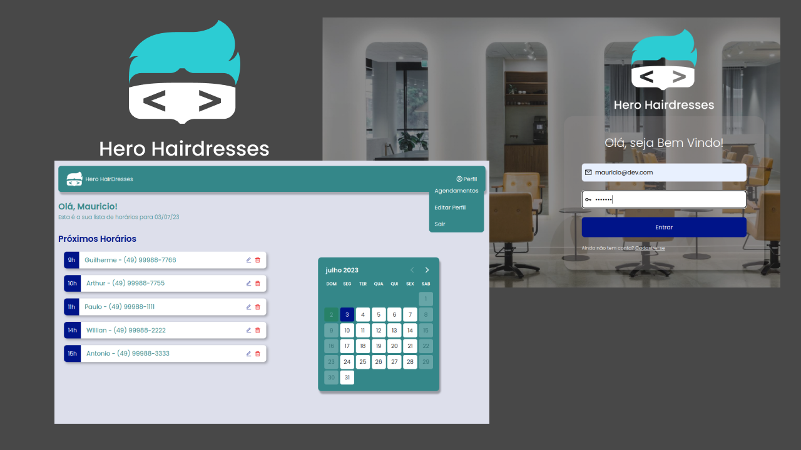

<h1 align="center"> Frontend Hero Hairdresses </h1>

<p align="center">
Frontend desenvolvido durante a <a href="https://www.youtube.com/@herocodebr">Semana do Herói</a>

<p align="center">
Neste projeto também tivemos o desenvolvimento do 
<a href="https://github.com/mauricioinhaia/hero-hairdresses">backend.</a>
</p>

<p align="center">
  <a href="#-tecnologias">Tecnologias</a>&nbsp;&nbsp;&nbsp;|&nbsp;&nbsp;&nbsp;
  <a href="#-projeto">Projeto</a>&nbsp;&nbsp;&nbsp;&nbsp;&nbsp;&nbsp;
</p>

<p align="center">
  
</p>

## 🚀 Tecnologias
<p align="justify">
Esse projeto foi desenvolvido com as seguintes tecnologias:
</p>

- React
- ContextAPI
- ModuleCSS
- Day Picker

## 💻 Projeto

<p align="justify">
O Hero Hairdresses e um sistema de agendamento de horários de um Salao de Beleza, onde o usuário pode manipular os agendamentos existes, criar novos e também gerenciar seu perfil.
</p>

## ▶️ Como Executar

<p align="justify">
Para executar o projeto, siga os passos abaixo:

- Acesse uma pasta de sua preferência:
```
cd /home/SEUNOME/Documents/git
```
- Clone o projeto:
```
git clone https://github.com/mauricioinhaia/hero-hairdresses-frontend.git
```

- Acesse a pasta do projeto:
```
cd hero-hairdresses-frontend
```
- Instale o Projeto (Necessário Yarn)
```
yarn
```
- Execute o Frontend
```
yarn dev
```

### Lembrando que para a aplicação funcionar corretamente, é necessário utilizar o <a href="https://github.com/mauricioinhaia/hero-hairdresses">backend.</a>

</p>

---

Feito com ♥ por mim! | HeroHairdresses by  [HeroCode](https://herocode.com.br/)